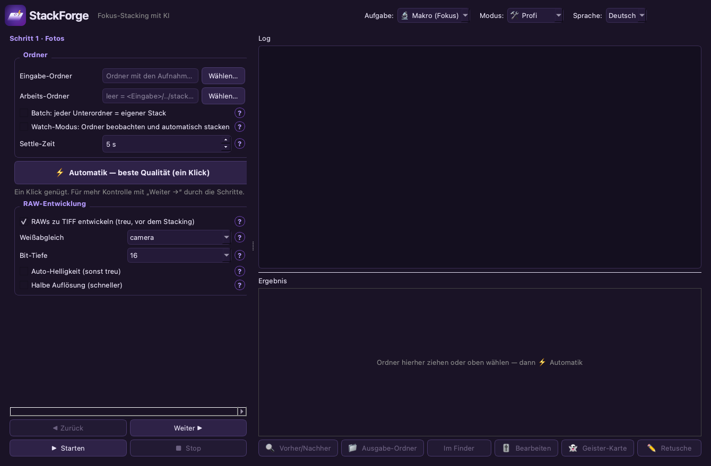
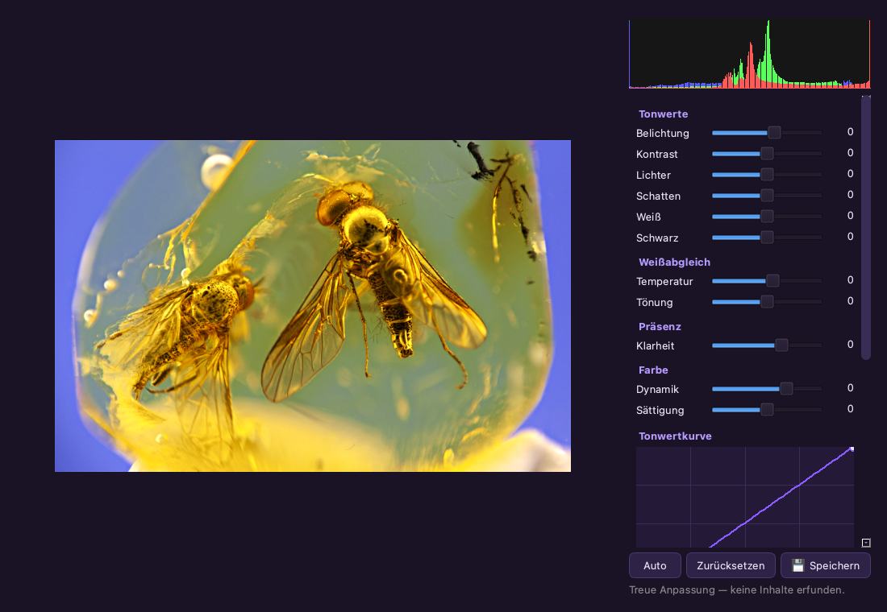

# StackForge ⚡

*[🇬🇧 English version](README.md)*

**Stacking mit einem Klick — für Makro & Astro.** Fotos rein, fertiges, gestochen scharfes
Bild raus — in bester Qualität zum Weiterbearbeiten. Eigenständig, frei (MIT),
plattformübergreifend (Windows / macOS / Linux).



## Highlights

- **Ein‑Klick‑Automatik** — wählt brauchbare Fotos aus, richtet sie aus, verschmilzt sie zu
  einem durchgehend scharfen Bild und schärft schonend nach. **Anfänger‑** und **Profi‑Modus**.
- **Start‑Auswahl:** beim Öffnen wählst du das **Modul** (jederzeit über „◀ Module“ wechselbar).
- **Vier Module, eine App:** 🔬 **Makro** (Fokus‑Stacking, mit Presets Produkte/Münzen/Food),
  🌌 **Astro** (Stern‑Stacking), 🌗 **Hybrid** (Mond‑/Sonnen‑**Mosaik** + **Fokus+Astro**:
  je Position erst entrauschen, dann fokus‑stacken) und 📷 **Langzeitbelichtung** (aus einer Serie
  **ohne ND‑Filter**: seidiges Wasser/Wolken, Lichtspuren, Störer entfernen — mit KI‑Effektvorschlag).
- **Eigene Engine** (OpenCV/NumPy) — keine externe Stacking‑Software nötig.
- **RAW** (ARW/NEF/CR2/DNG …) treu in 16‑bit entwickelt, **EXIF bleibt erhalten**.
- **Eingebauter Camera‑Raw‑Editor:** Belichtung/Kontrast/Weißabgleich, **Tonwertkurve**,
  **HSL pro Farbe**, Klarheit, **Zuschneiden/Drehen**, Histogramm.
- **Retusche‑Editor:** scharfe Stellen aus Einzelfotos über Halos/**Ghosting** pinseln, mit Radierer.
- **Geister‑Karte + Deghost**, **Vorher/Nachher‑Schieberegler**, **Filmstreifen**,
  **Export‑Voreinstellungen** (Instagram/WhatsApp/Web/4K/Druck), **Batch** & **Watch‑Ordner**.
- **Astro:** Kalibrierung (Darks/Flats/Bias), Stern‑Ausrichtung, **Sigma/Winsor‑Rejection**
  (entfernt Satelliten/Hot‑Pixel), Hintergrund‑Extraktion, **erklärbare Sub‑Bewertung**
  (FWHM, Sternzahl, Elongation/Guiding, Wolken, Spuren — schlechte Subs fliegen raus *mit Begründung*),
  32‑bit‑Linear‑Export für GraXpert/StarNet++/PixInsight. **FITS** lesen & schreiben (optional, via astropy).
- **Große Stacks** werden gebündelt gestreamt (speicherschonend).

## Läuft überall — KI ist optional

Die Automatik funktioniert **komplett ohne KI** (Einstellungen aus dem gemessenen Schärfeprofil).
**Kein Ollama, kein Server, kein Modell‑Download.** Optional ein OpenAI‑kompatibler Server
(llama.cpp / LM Studio / vLLM) **oder ein Anbieter mit API‑Schlüssel** (OpenAI / OpenRouter).
Die KI **berät & prüft** nur — sie bearbeitet nie Pixel. *„Die Software erklärt, warum sie
diese Einstellungen gewählt hat.“*

Profis können optional **Siril verbinden** (falls installiert) als alternative Astro‑Engine und
an **GraXpert / StarNet++** weitergeben — nichts davon ist Pflicht.

## Installation

```bash
python3 -m pip install -r requirements.txt
python3 focus_stack_gui.py
```

- **macOS:** `StackForge.app` doppelklicken (optional `exiftool` für EXIF‑Übernahme).
- **Windows:** `run.bat`  ·  **Linux:** `./run.sh`

## Erste Schritte

1. **🌱 Anfänger** (Standard): Ordner wählen (oder aufs Fenster ziehen) → **⚡ Loslegen**. Fertig.
2. **🛠️ Profi:** geführter 4‑Schritte‑Wizard mit allen Reglern, Astro‑Modus, KI‑Server usw.

> Jede Einstellung hat ein **?** mit Klartext‑Erklärung. Im Zweifel reicht die Automatik.

## Editor



## Sprachen

Deutsch & Englisch eingebaut (oben rechts umschalten, greift beim Neustart). Eigene Sprache:
`lang/de.json` kopieren, Werte übersetzen, z.B. als `lang/fr.json` speichern — erscheint
automatisch in der Sprachauswahl.

## Lizenz

MIT (siehe `LICENSE`). Nur freie Bausteine: OpenCV, NumPy, rawpy, tifffile, psdtags,
PySide6 (LGPL). Astro‑Methoden inspiriert von [Siril](https://siril.org) (selbst neu
implementiert, kein GPL‑Code kopiert).
