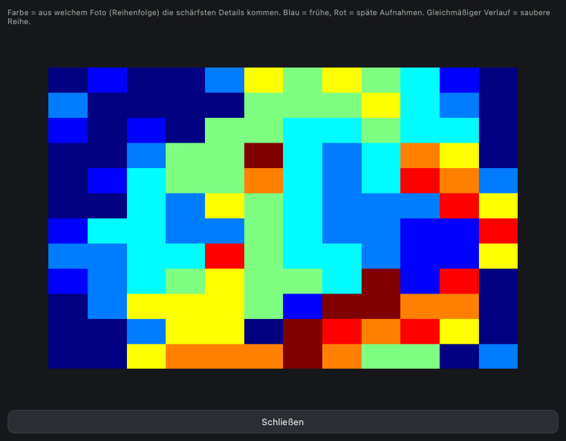
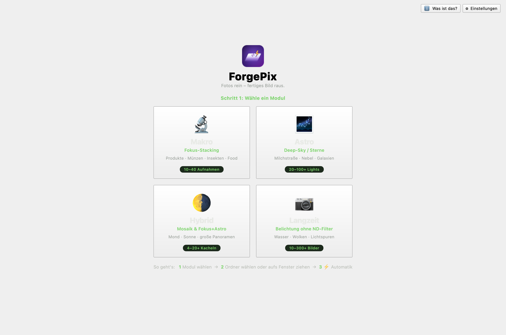
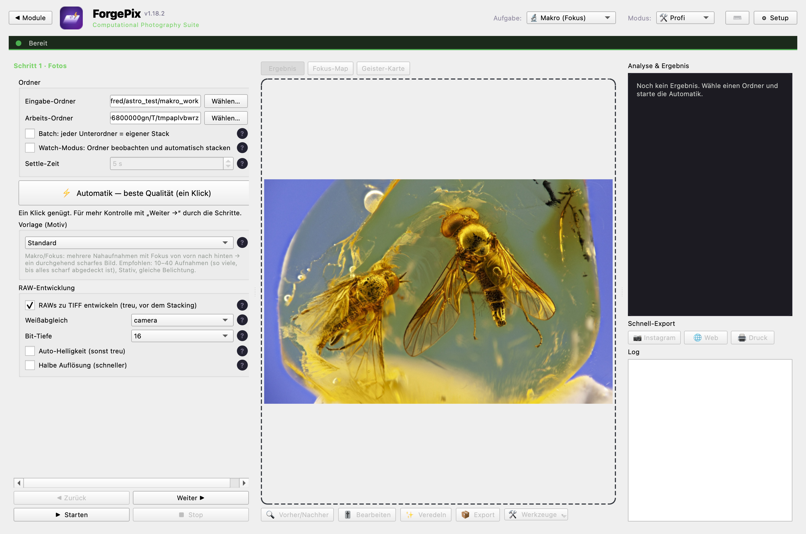
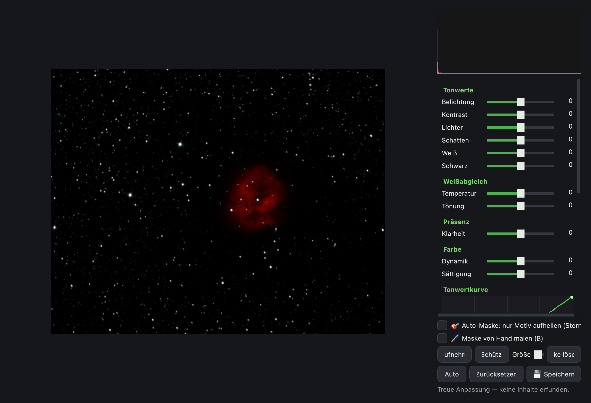
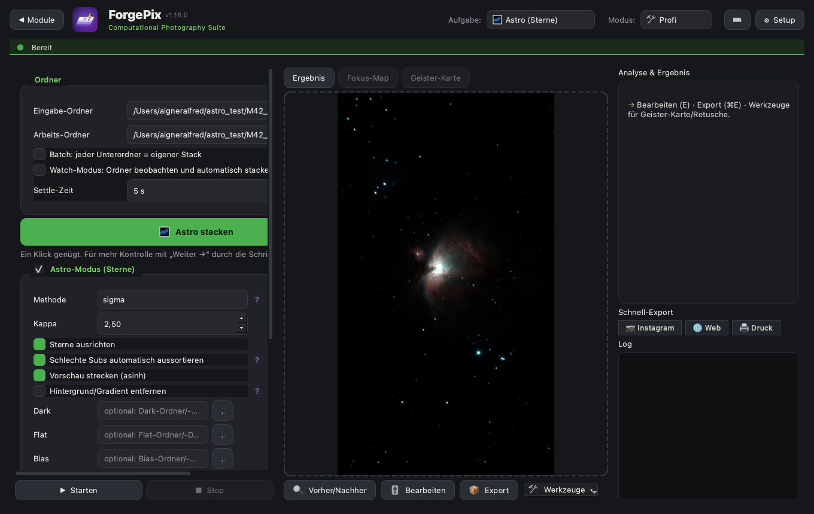

# ForgePix ⚡

### [forgepix.app](https://forgepix.app) · Focus • Astro • Long Exposure

*[🇩🇪 Deutsche Version](README.de.md)*


[](https://github.com/samuelvoltarius/ForgePix/releases)
[](LICENSE)

> **ForgePix Beta** — automatic focus stacking and computational photography for **macro, astro
> and long‑exposure** series. **Local‑first, AI optional.** It’s usable and tested, but young —
> expect the occasional rough edge and please [report issues](https://github.com/samuelvoltarius/ForgePix/issues).

**Focus Stacking + Astro + Long Exposure.** Drop your photos in, get a finished image out — in
the best possible quality for further editing. Self‑contained, free (MIT), cross‑platform
(Windows / macOS / Linux).

## Why ForgePix?

> - ✓ **Analyses focus series**
> - ✓ **Removes rejects automatically**
> - ✓ **Computes the optimal frame count**
> - ✓ **Long exposure without an ND filter**
> - ✓ **Astro + macro in one app**
> - ✓ **Works without AI** (fully local, no server)

## How it works

A soft focus series becomes one fully sharp image — and you see *what* happens at every step:

| 1 · Input (series) | 2 · Analysis | 3 · Focus map | 4 · Result |
|---|---|---|---|
|  |  |  |  |
| *9 frames, each only partly sharp* | *shaky dropped, optimal frame count* | *which area from which photo* | *fully sharp, ready to edit* |

📖 **Full guide:** [docs/GUIDE.en.md](docs/GUIDE.en.md) · *[🇩🇪 Anleitung](docs/GUIDE.de.md)*

| Start screen | Macro module |
|---|---|
|  |  |
| **Camera‑Raw editor** | **Astro module** |
|  |  |

## Highlights

- **One‑click Automatic** — picks the usable frames, aligns them, merges them into a
  fully‑sharp image and sharpens gently. **Beginner** and **Pro** mode.
- **Zero‑click in Beginner mode:** just **drop a folder** on the window — ForgePix guesses the
  right module (from file types / names / a quick EXIF sample) and starts the automatic. In → done.
- **Startup picker:** choose the **module** when you open the app (switch any time via “◀ Modules”).
- **Focus intelligence** (macro): auto-drop shaky photos, **series analysis** (shot analysis +
  stack optimizer + **focus map**), **DOF / focus-bracketing assistant** with **EXIF read-out**,
  **stack confidence score** with real metrics.
- **Decision panel** next to the result: confidence score, “X of Y frames used”, **clickable
  findings** (a finding jumps straight to the matching view — ghosting → ghost map, halos →
  retouch, focus gaps → focus map) and a **“Why these settings?”** rationale from the automatic.
- **Quick-export chips** (📷 Instagram · 🌐 Web · 🖨 Print) for one-click export right next to the
  result; **“Resume”** on the start screen reopens your last folder + module.
- **Update hint:** on start it quietly checks the GitHub releases and shows a discreet “new version
  available” note if there is one — fully optional (Setup), no data sent.
- **Fully keyboard-operable** (⌘O folder, ⌘↩ automatic, ⌘1–4 modules, F1 = shortcut overview …).
- **Four modules, one app:** 🔬 **Macro** (focus stacking, with Product/Coin/Food presets),
  🌌 **Astro** (star stacking), 🌗 **Hybrid** (Moon/Sun **mosaic** + **Focus+Astro**:
  denoise each position, then focus‑stack) and 📷 **Long exposure** (from a burst, **no ND filter**:
  silky water/clouds, light trails, remove movers — with AI effect suggestion and a
  **virtual exposure time** slider (continuous partial averaging)).
- **Own engine** (OpenCV/NumPy) — no external stacking software required.
- **RAW** (ARW/NEF/CR2/DNG …) developed faithfully to 16‑bit before stacking; **EXIF kept**.
- **Built‑in Camera‑Raw editor:** exposure/contrast/white balance, **tone curve**,
  **per‑color HSL**, clarity, **crop/rotate**, histogram.
- **Retouch editor:** brush sharp areas from single frames over halos/**ghosting**, with eraser.
- **Ghost map + deghost**, **before/after slider**, **film strip**, **export presets**
  (Instagram/WhatsApp/Web/4K/Print), **batch** & **watch folder**.
- **Astro:** calibration (darks/flats/bias), star alignment (**translation or field rotation**
  for Alt‑Az), **hot/cold‑pixel correction**, **drizzle‑lite** (2× finer sampling),
  **Sigma/Winsorized rejection** (removes satellites/hot pixels), background extraction,
  **explainable sub‑grading** (FWHM, star count, elongation/guiding, clouds, trails — bad subs dropped
  *with reasons*), 32‑bit linear export + **FITS**. **GraXpert & StarNet++ one‑click** (if installed:
  run + re‑import automatically; otherwise file hand‑off).
- **Large stacks** are streamed in bundles (memory‑friendly).
- **Fast:** RAW development and sharpness analysis run across **all CPU cores**; sharpness results
  are **cached** per file (re‑runs are instant) and the embedded camera JPEG is used for the culling
  pass — big RAW series analyse much faster.

## Runs everywhere — AI is optional

Automatic works **completely without AI** (settings derived from the measured sharpness
profile). **No Ollama, no server, no model download.** Optionally connect an OpenAI‑compatible
server (llama.cpp / LM Studio / vLLM) **or a provider with API key** (OpenAI / OpenRouter).
The AI only **advises & checks** — it never touches pixels. *“The software explains why it
chose these settings.”* You can add a **free‑text wish** (e.g. “silky water, people sharp”) and the
suggestion also gets **EXIF basics** + the **focus map**. Setup states exactly what is sent — a few
preview frames, the sharpness profile, EXIF basics and your wish; no original files, no location data.

Pros can optionally **connect Siril** (if installed) as an alternative astro engine, and
hand off to **GraXpert / StarNet++** — none of it is required.

## Download (prebuilt)

Ready‑made packages for **macOS · Windows · Linux** are on the
[**Releases page**](https://github.com/samuelvoltarius/ForgePix/releases) (no Python needed):

- **macOS:** `ForgePix-macOS.zip` → unzip, open `ForgePix.app`.
- **Windows:** `ForgePix-Windows.zip` → unzip, run `ForgePix.exe`.
- **Linux:** `ForgePix-Linux.tar.gz` → extract, run `./ForgePix/ForgePix`.

> First launch on macOS/Windows: right‑click → “Open” (the app isn’t notarised yet —
> [enable signing](docs/SIGNING.md)).

## From source

```bash
python3 -m pip install -r requirements.txt
python3 focus_stack_gui.py
```

- **macOS:** double‑click `ForgePix.app` (optional `exiftool` for EXIF copy).
- **Windows:** `run.bat`  ·  **Linux:** `./run.sh`

## First steps

1. Open the app → **pick a module** (Macro / Astro / Hybrid / Long exposure).
2. **🌱 Beginner** (default): pick a folder (or drag it onto the window) → **⚡ Start**. Done.
3. **🛠️ Pro:** guided wizard with all controls, AI server, external tools, etc.

> Every setting has a **?** with a plain‑language explanation. The recommended frame count per
> module is shown right in its group — details in the [guide](docs/GUIDE.en.md).

## External tools (optional)

In the **Setup menu (⚙) → "External tools"** you set paths to **GraXpert**, **StarNet++** and
**Siril** (or leave empty = auto‑detect). For Astro/Long‑exposure/Hybrid you can then send the
result through GraXpert (gradient) or StarNet++ (starless) with **one click** — including
automatic re‑import. None of it is required.

## Languages

German & English built in (switch top‑right, applies on restart). Add your own language:
copy `lang/de.json`, translate the values, save as e.g. `lang/fr.json` — it appears in the
language menu automatically.

## Keyboard shortcuts

**Photo keys** (Lightroom-style): **Space** before/after · **← →** switch image · **A** analyse ·
**S** stack · **E** editor · **G** ghost map · **F** focus map · **R** retouch.
**Commands:** ⌘O folder · ⌘↩ automatic · ⌘E export · ⎋ stop/back · ⌘1–4 modules · ⌘B beginner/pro ·
⌘D DOF · **F1** = full overview. *Dropping a folder on the window starts the analysis.*

## Tests

```bash
./run_tests.sh        # or: python3 -m unittest discover -s tests
```

47 engine tests (standard library, no pytest needed) cover focus analysis, long exposure, astro,
stacker, mosaic, export, parallel helper, module guessing, AI context, i18n completeness and a GUI
smoke test.

## License

MIT (see `LICENSE`). Built only on permissive components: OpenCV, NumPy, rawpy, tifffile,
psdtags, PySide6 (LGPL). Astro methods inspired by [Siril](https://siril.org) (re‑implemented,
no GPL code copied).
