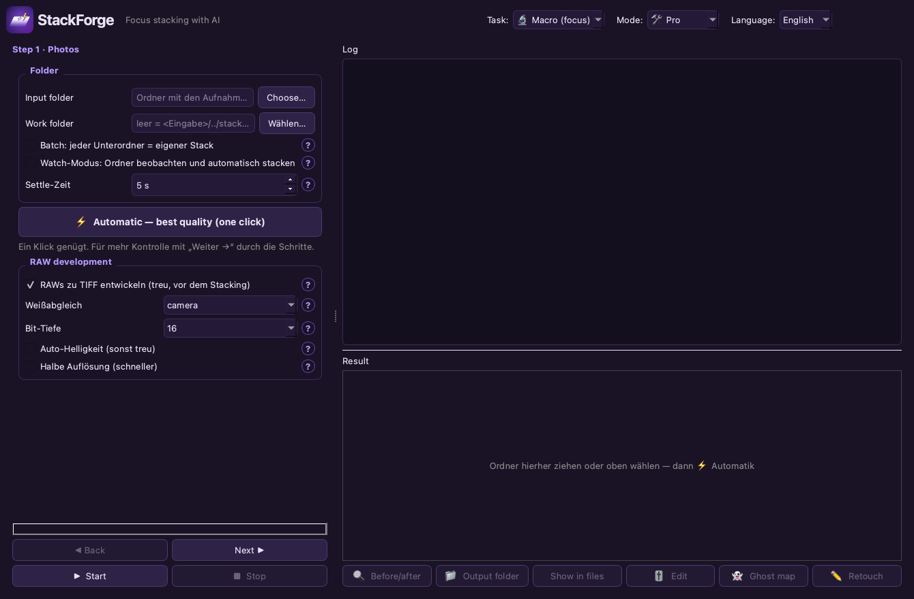

# StackForge ⚡

*[🇩🇪 Deutsche Version](README.de.md)*

**One‑click stacking for macro & astro.** Drop your photos in, get a finished, razor‑sharp
image out — in the best possible quality for further editing. Self‑contained, free (MIT),
cross‑platform (Windows / macOS / Linux).



## Highlights

- **One‑click Automatic** — picks the usable frames, aligns them, merges them into a
  fully‑sharp image and sharpens gently. **Beginner** and **Pro** mode.
- **Startup picker:** choose the **module** when you open the app (switch any time via “◀ Modules”).
- **Four modules, one app:** 🔬 **Macro** (focus stacking, with Product/Coin/Food presets),
  🌌 **Astro** (star stacking), 🌗 **Hybrid** (Moon/Sun **mosaic** + **Focus+Astro**:
  denoise each position, then focus‑stack) and 📷 **Long exposure** (from a burst, **no ND filter**:
  silky water/clouds, light trails, remove movers — with AI effect suggestion and a
  **virtual exposure time** slider (continuous partial averaging)).
- **Own engine** (OpenCV/NumPy) — no external stacking software required.
- **RAW** (ARW/NEF/CR2/DNG …) developed faithfully to 16‑bit before stacking; **EXIF kept**.
- **Built‑in Camera‑Raw editor:** exposure/contrast/white balance, **tone curve**,
  **per‑color HSL**, clarity, **crop/rotate**, histogram.
- **Retouch editor:** brush sharp areas from single frames over halos/**ghosting**, with eraser.
- **Ghost map + deghost**, **before/after slider**, **film strip**, **export presets**
  (Instagram/WhatsApp/Web/4K/Print), **batch** & **watch folder**.
- **Astro:** calibration (darks/flats/bias), star alignment (**translation or field rotation**
  for Alt‑Az), **hot/cold‑pixel correction**, **drizzle‑lite** (2× finer sampling),
  **Sigma/Winsorized rejection** (removes satellites/hot pixels), background extraction,
  **explainable sub‑grading** (FWHM, star count, elongation/guiding, clouds, trails — bad subs dropped
  *with reasons*), 32‑bit linear export + **FITS**. **GraXpert & StarNet++ one‑click** (if installed:
  run + re‑import automatically; otherwise file hand‑off).
- **Large stacks** are streamed in bundles (memory‑friendly).

## Runs everywhere — AI is optional

Automatic works **completely without AI** (settings derived from the measured sharpness
profile). **No Ollama, no server, no model download.** Optionally connect an OpenAI‑compatible
server (llama.cpp / LM Studio / vLLM) **or a provider with API key** (OpenAI / OpenRouter).
The AI only **advises & checks** — it never touches pixels. *“The software explains why it
chose these settings.”*

Pros can optionally **connect Siril** (if installed) as an alternative astro engine, and
hand off to **GraXpert / StarNet++** — none of it is required.

## Install

```bash
python3 -m pip install -r requirements.txt
python3 focus_stack_gui.py
```

- **macOS:** double‑click `StackForge.app` (optional `exiftool` for EXIF copy).
- **Windows:** `run.bat`  ·  **Linux:** `./run.sh`

## First steps

1. **🌱 Beginner** (default): pick a folder (or drag it onto the window) → **⚡ Start**. Done.
2. **🛠️ Pro:** guided 4‑step wizard with all controls, astro mode, AI server, etc.

> Every setting has a **?** with a plain‑language explanation. When in doubt, Automatic is enough.

## Editor


## Languages

German & English built in (switch top‑right, applies on restart). Add your own language:
copy `lang/de.json`, translate the values, save as e.g. `lang/fr.json` — it appears in the
language menu automatically.

## License

MIT (see `LICENSE`). Built only on permissive components: OpenCV, NumPy, rawpy, tifffile,
psdtags, PySide6 (LGPL). Astro methods inspired by [Siril](https://siril.org) (re‑implemented,
no GPL code copied).
